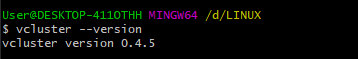
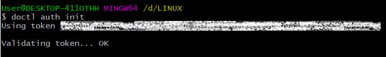
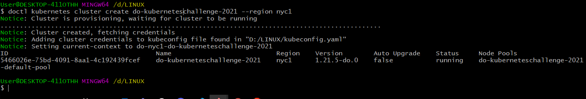
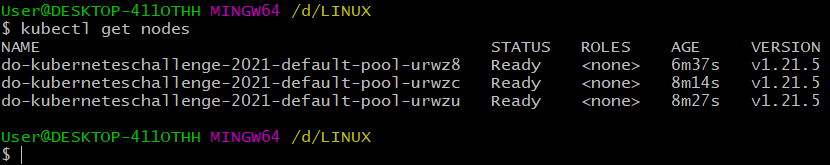
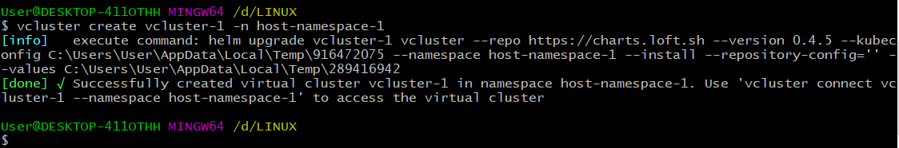
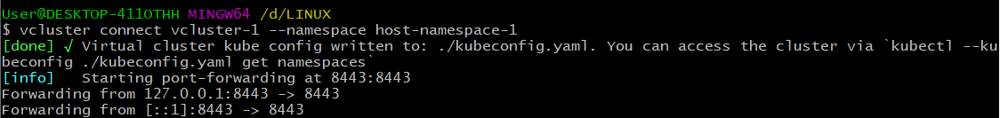
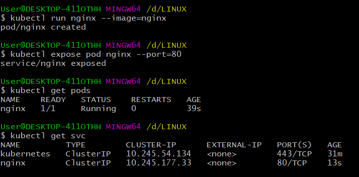
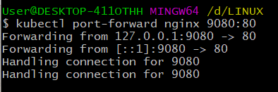
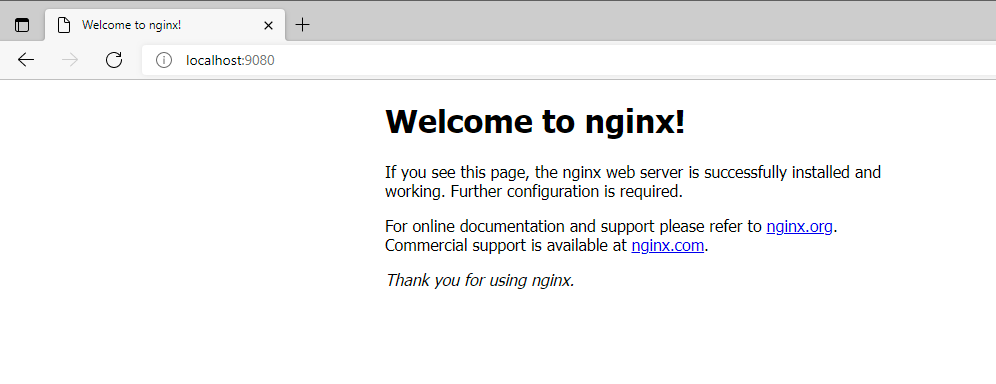

# Deploy a virtual cluster solution

>Virtual clusters are fully working Kubernetes clusters that run on top of other Kubernetes clusters. Compared to fully separate "real" clusters, virtual clusters do not have their own node pools. Instead, they are scheduling workloads inside the underlying cluster while having their own separate control plane.


## Requirements

- kubectl (check via kubectl version)
- helm v3 (check with helm version)
- a working kube-context with access to a Kubernetes cluster (check with kubectl get namespaces)

## Steps

- install tools (assuming on Windows Powershell)

  reference: [vcluster guide](https://www.vcluster.com/docs/getting-started/setup)

```
md -Force "$Env:APPDATA\vcluster"; [System.Net.ServicePointManager]::SecurityProtocol = [System.Net.SecurityProtocolType]'Tls,Tls11,Tls12';
Invoke-WebRequest -UseBasicParsing ((Invoke-WebRequest -URI "https://github.com/loft-sh/vcluster/releases/latest" -UseBasicParsing).Content -replace "(?ms).*`"([^`"]*vcluster-windows-amd64.exe)`".*","https://github.com/`$1") -o $Env:APPDATA\vcluster\vcluster.exe;
$env:Path += ";" + $Env:APPDATA + "\vcluster";
[Environment]::SetEnvironmentVariable("Path", $env:Path, [System.EnvironmentVariableTarget]::User);
```

- To confirm that vcluster CLI is successfully installed, test via:

```
vcluster --version
```



- Authentication in DigitalOcean

```
doctl auth init
```



- Provisioning kubernetes cluster in DigitalOcean

```
doctl kubernetes cluster create do-kuberneteschallenge-2021 --region nyc1
```



- Verify active nodes

```
kubectl get nodes
```



- Deploy vcluster

```
vcluster create vcluster-1 -n host-namespace-1
```



- Running vcluster

```
vcluster connect vcluster-1 --namespace host-namespace-1
```



- Connect to vcluster (in another terminal)

```
export KUBECONFIG=$PWD/kubeconfig.yaml
kubectl get nodes
```


- Test the nginx application in this new vcluster

```
kubectl run nginx --image=nginx
kubectl expose pod nginx --port=80
#verify the pod and service
kubectl get pods
kubectl get svc
#Use port forwarding to access nginx application
kubectl port-forward nginx 9080:80
```








- done!
