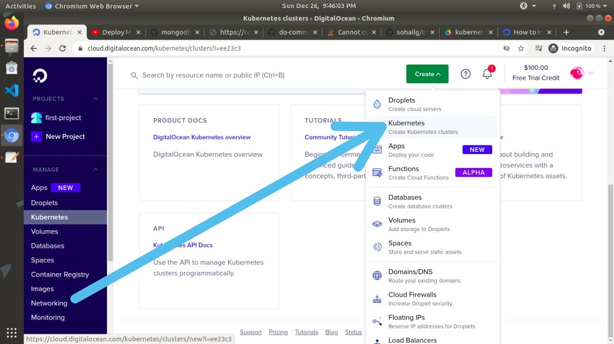
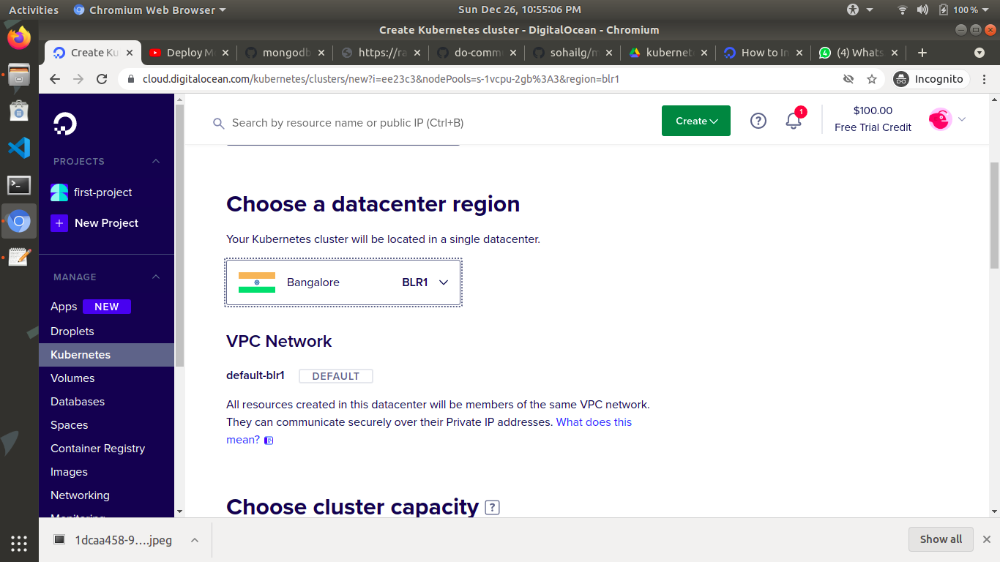
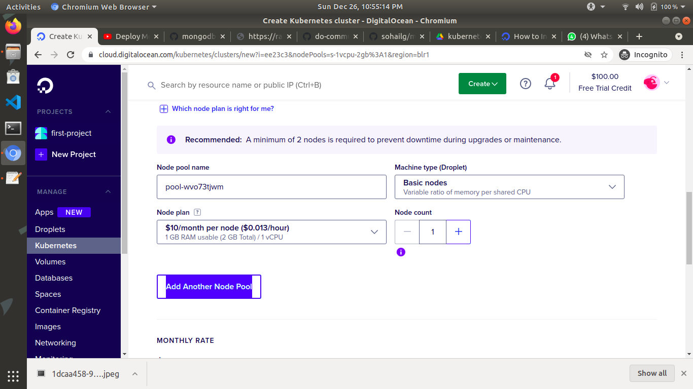
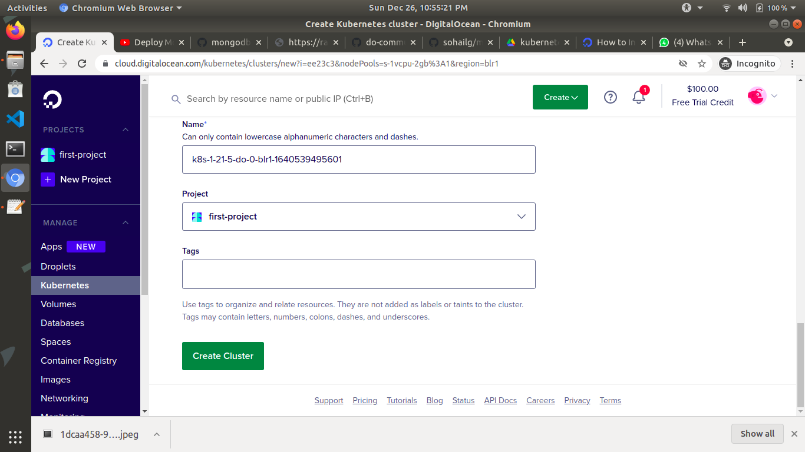
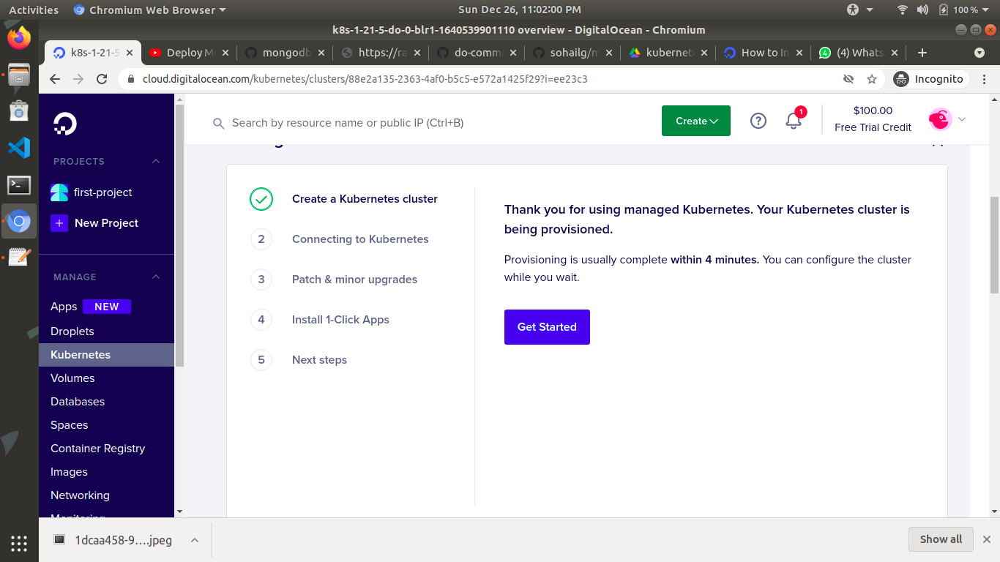
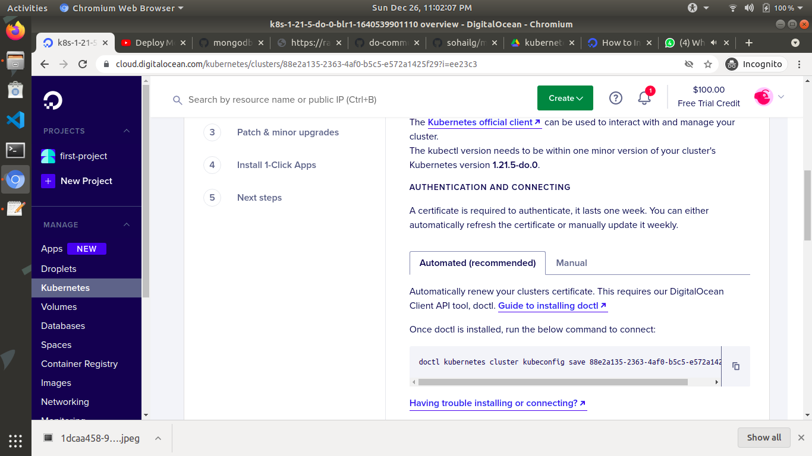
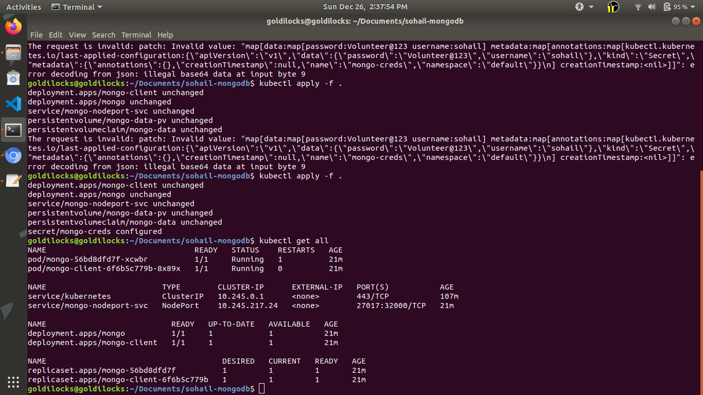

<<<<<<< HEAD
# DigitalOcean Kubernetes Challenge 

## Contributing

1. If you completed the DigitalOcean Kubernetes Challenge, please fork this repo, create a new markdown file using this naming format (`username-kubernetes-challenge.md`, for example: `kimschles-kubernetes-challenge.md`), and use the [template](template.md) to share your project info, writeup and contact information. 

Note: Please provide links to any videos insteading of uploading to github. We recommend uploading them to YouTube and then sharing the link to the video.

2. [Submit a pull request](https://help.github.com/articles/creating-a-pull-request-from-a-fork/).

3. Be proud of yourself for completing the DigitalOcean Kubernetes Challenge and check your email inbox in January of 2022 for information about your prize! 


=======
# mongodb-kubernetes
## Mongodb cluster with kubernetes in digitalocean(Ubuntu)
prerequisites needed:
- [doctl](https://docs.digitalocean.com/reference/doctl/how-to/install/)
- [kubectl](https://kubernetes.io/docs/tasks/tools/install-kubectl-linux/)

### task1
- Create kubernetes cluster in your project segment in digitalocean.
- choose 
-- datacenter:bangalore
-- nodeplan: $10/month per node
-- node count: 1
and others as default






### task2
- After node Creation,scroll down and press "Overview"
- press "Get started!"
- In "connecting to kubernetes" , copy the command and paste it in terminal of the linux.




### task3
- files have been created already for deployment
- change the credentials in mongodb-secrets.yaml of your own with base64 encoder!
- press right click on mouse and click "open in terminal", there copy this codes
```sh
kubectl apply -f .
```
- then check that mongo is implemented by
```sh
kubectl get all
```

- After mongo is setup:
```sh
kubectl exec deployment/mongo-client -it -- /bin/bash
```
- after this then just put your credentials.
```sh
mongo --host mongo-nodeport-svc --port 27017 -u #username -p #password
```
replace #username/#password with your credentials.

if this doesn't work. then copy below code and paaste it.
```sh
mongodb
```

## Successfully completed the task!
credits:[arpan](https://www.youtube.com/watch?v=V5-0bJXTq4E)
>>>>>>> New


